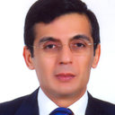

---
# You don't need to edit this file, it's empty on purpose.
# Edit theme's home layout instead if you wanna make some changes
# See: https://jekyllrb.com/docs/themes/#overriding-theme-defaults
layout: home
---

# ICASIA|2018 Conference Keynote Speakers

<h3 id="thumbnail-label">Prof.Dr Mustafa Özakça<a class="anchorjs-link" href="#thumbnail-label"></a></h3>

Mustafa Özakça currently works at the Department of Civil Engineering, Gaziantep University. Mustafa does research in Civil Engineering, Mechanical Engineering and Structural Engineering. Their current project is 'Comparison of Various Bracing System for Self-Supporting Steel Lattice Structure Towers.

<a href="https://www.gantep.edu.tr/en/akademik/index.php?ana=0&akadID=479&bolum_id=0" class="btn btn-raised btn-primary" role="button">more info</a>

