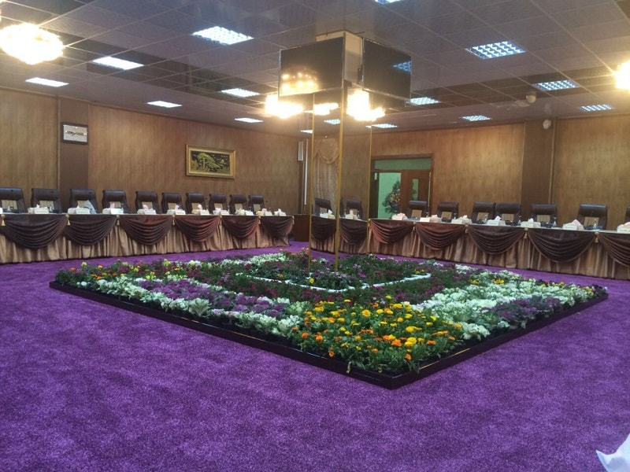
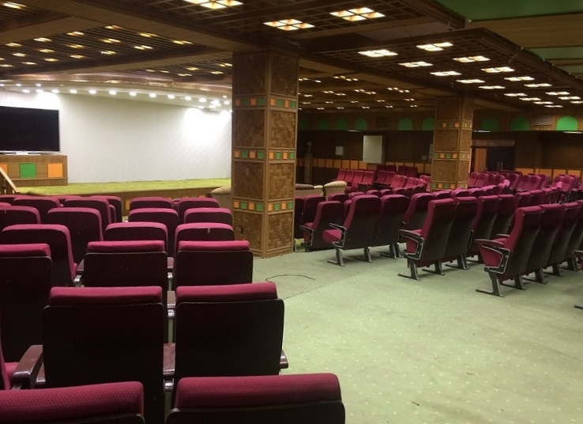
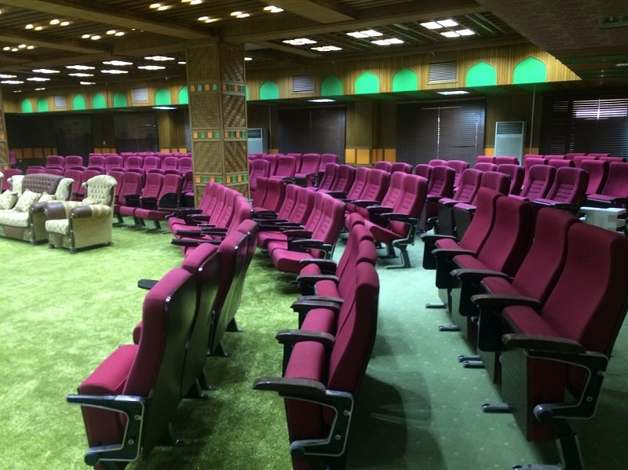
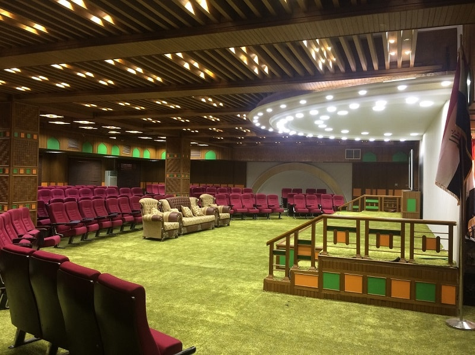
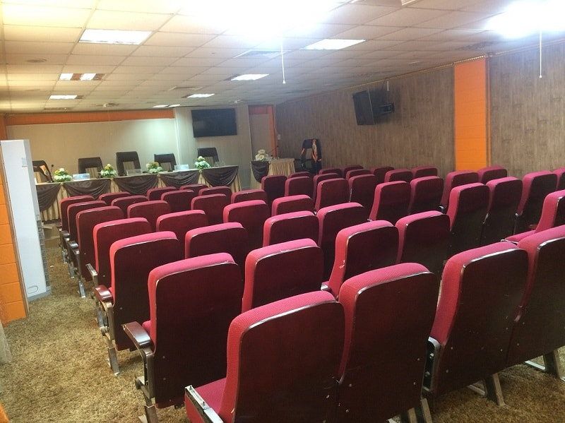
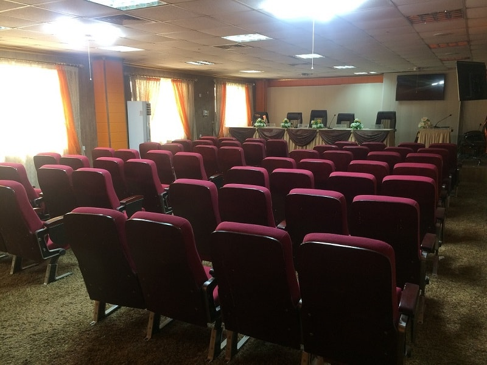
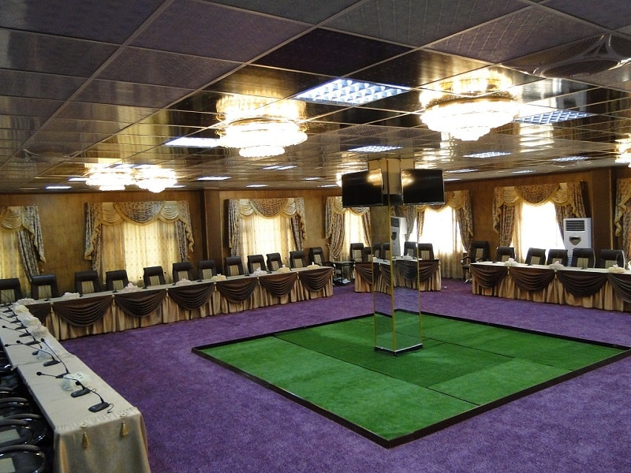
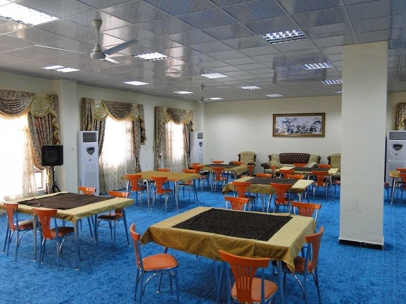
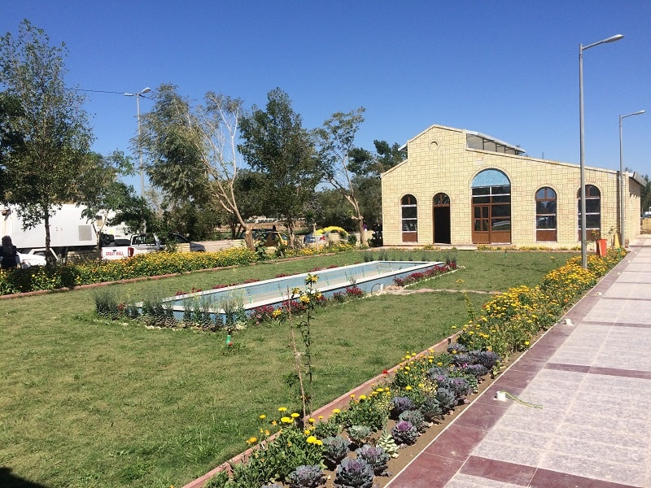

---
# You don't need to edit this file, it's empty on purpose.
# Edit theme's home layout instead if you wanna make some changes
# See: https://jekyllrb.com/docs/themes/#overriding-theme-defaults
layout: home
---

# Conference Venue

The conference will be held from 29-30  November 2017 at the College of Engineering, Wasit University , located in the heart of the city center and 2-hours from Baghdad International Airport.

<button class="close" type="button" data-dismiss="modal">×</button>
<h3 class="modal-title">Heading</h3>

<button class="btn btn-default" data-dismiss="modal">Close</button>

